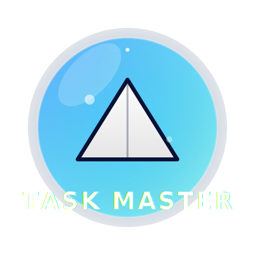

# Task Master - Priority Queue System 💎

<div align="center">
  
  <br />
  <h1>Task Master</h1>
  <p><strong>Liquid Edition v1.0</strong></p>
  <p>A Premium Task Management System powered by <strong>C</strong> and <strong>Max Heap</strong> logic.</p>

  [](https://opensource.org/licenses/MIT)
  
  
  
</div>

---

## 📸 Project Screenshot

<div align="center">
  
</div>

---

## 🚀 About The Project

**Task Master** is a high-performance Task Management System designed for the 3rd Semester CSE (AI/ML) curriculum. It demonstrates the practical application of **Data Structures and Algorithms (DSA)** by implementing a **Priority Queue** using a **Max Heap**.

### Key Features
*   **Core Logic in C**: The entire Heap data structure (Insertion, Extraction, Bubble Up/Down) is written in pure C for maximum performance.
*   **Liquid Glass UI**: A stunning, modern frontend featuring deep glassmorphism, neon gradients, and a "Nano-Grade" aesthetic.
*   **Real-Time Visualization**: Watch the internal memory of the Heap update in real-time as you add tasks.
*   **Hybrid Architecture**: Uses Node.js to bridge the gap between the modern Web UI and the low-level C backend.

---

## 🛠️ Tech Stack

*   **Frontend**: HTML5, CSS3 (Liquid Glass Design), Vanilla JavaScript (Vite)
*   **Middleware**: Node.js, Express
*   **Backend**: C Programming Language (GCC Compiler)

---

## 👨‍💻 Group Members (F15)

| USN | Name |
| :--- | :--- |
| **4NI24CI108** | **Sourabh** |
| **4NI24CI104** | **Shreyas J** |
| **4NI23CI040** | **Dimpu K J** |
| **4NI24CI123** | **Harsh vardhan** |

---

## ⚙️ How to Run

This project requires **Two Terminals** to run (one for the C backend wrapper, one for the frontend).

### Prerequisites
*   GCC Compiler (for C)
*   Node.js & npm

### Step 1: Compile the C Backend
Navigate to the project folder and run:
```bash
gcc src/priority_queue.c -o priority_queue
```

### Step 2: Start the Server (Terminal 1)
This starts the Node.js bridge that talks to the C program.
```bash
node server.js
```
*You should see: "Server running at http://localhost:3000"*

### Step 3: Start the Frontend (Terminal 2)
Open a new terminal and run:
```bash
npm run dev
```
*Open the link provided (usually http://localhost:5173) in your browser.*

---

## 📝 License

Distributed under the MIT License. See `LICENSE` for more information.

```text
MIT License

Copyright (c) 2024 Group F15

Permission is hereby granted, free of charge, to any person obtaining a copy
of this software and associated documentation files (the "Software"), to deal
in the Software without restriction, including without limitation the rights
to use, copy, modify, merge, publish, distribute, sublicense, and/or sell
copies of the Software, and to permit persons to whom the Software is
furnished to do so, subject to the following conditions:

The above copyright notice and this permission notice shall be included in all
copies or substantial portions of the Software.

THE SOFTWARE IS PROVIDED "AS IS", WITHOUT WARRANTY OF ANY KIND, EXPRESS OR
IMPLIED, INCLUDING BUT NOT LIMITED TO THE WARRANTIES OF MERCHANTABILITY,
FITNESS FOR A PARTICULAR PURPOSE AND NONINFRINGEMENT. IN NO EVENT SHALL THE
AUTHORS OR COPYRIGHT HOLDERS BE LIABLE FOR ANY CLAIM, DAMAGES OR OTHER
LIABILITY, WHETHER IN AN ACTION OF CONTRACT, TORT OR OTHERWISE, ARISING FROM,
OUT OF OR IN CONNECTION WITH THE SOFTWARE OR THE USE OR OTHER DEALINGS IN THE
SOFTWARE.
```
