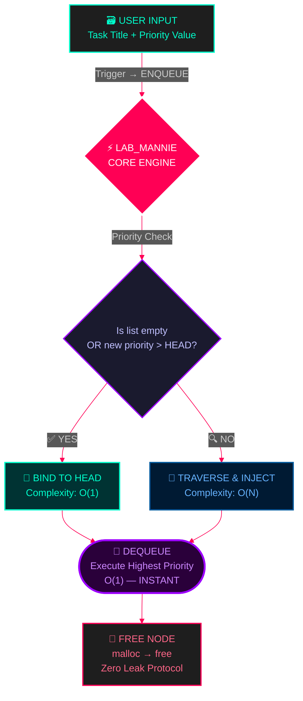

<div align="center">

<!-- ═══════════════════════════════════════════════════════════════ -->
<!--                  🌟 HERO HEADER — WAVING GRADIENT              -->
<!-- ═══════════════════════════════════════════════════════════════ -->


<br>

<!-- ═══════════════════════════════════════════════════════════════ -->
<!--             💻 HACKER BOOT SEQUENCE — TYPING ANIMATION         -->
<!-- ═══════════════════════════════════════════════════════════════ -->
<a href="https://github.com/LabMannie">
  
</a>

<br><br>

<!-- ═══════════════════════════════════════════════════════════════ -->
<!--                    🛡️ ELITE STATUS BADGES                      -->
<!-- ═══════════════════════════════════════════════════════════════ -->
[](https://github.com/LabMannie)
[](#)
[_DEQUEUE-00FFCC?style=for-the-badge&logo=aerospike&logoColor=black)](#)
[](#)
[](#)

<br>

<!-- ═══════════════════════════════════════════════════════════════ -->
<!--               🔥 ANIMATED METRICS / STATS ROW                  -->
<!-- ═══════════════════════════════════════════════════════════════ -->


-9D00FF?style=flat-square&labelColor=0d0d0d)


<br>

> 🌌 *"Where others write code, I engineer digital physics.*
> *Efficiency is not an option — it is the baseline."*
>
> **— LAB MANNIE**

</div>

---

<!-- ═══════════════════════════════════════════════════════════════ -->
<!--                     💠 CORE DIRECTIVE                          -->
<!-- ═══════════════════════════════════════════════════════════════ -->

## 💠 THE CORE DIRECTIVE


Welcome to the absolute pinnacle of Command Line interfaces. Engineered entirely from scratch by **LabMannie**, this system completely bypasses bloated modern frameworks to deliver a **hyper-optimized, dynamically-allocated Priority Queue**.

This is not a simple to-do list. This is a **Task Execution Engine** built on a mathematically sorted **Singly Linked List**, enclosed within a visually stunning ANSI-powered Control Deck.

**Every nanosecond. Every allocation. Every decision.** Ruthlessly optimized.

<br clear="right"/>

---

<!-- ═══════════════════════════════════════════════════════════════ -->
<!--               ⚡ ARCHITECTURAL SUPERSTRUCTURE                  -->
<!-- ═══════════════════════════════════════════════════════════════ -->

## ⚡ ARCHITECTURAL SUPERSTRUCTURE — L-PQ ENGINE


```mermaid
%%{init: {'theme': 'dark', 'themeVariables': { 'primaryColor': '#1e1e1e', 'primaryTextColor': '#00FFCC', 'primaryBorderColor': '#00FFCC', 'lineColor': '#FF0055', 'secondaryColor': '#0d0d0d', 'tertiaryColor': '#1a1a2e'}}}%%
graph TD
    A["🗃️ USER INPUT<br/>Task Title + Priority Value"] -->|"Trigger → ENQUEUE"| B

    B{"⚡ LAB_MANNIE<br/>CORE ENGINE"}

    B -->|"Priority Check"| C{"Is list empty<br/>OR new priority > HEAD?"}

    C -->|"✅  YES"| D["🔗 BIND TO HEAD<br/>Complexity: O(1)"]
    C -->|"🔍  NO"| E["🔎 TRAVERSE & INJECT<br/>Complexity: O(N)"]

    D --> F(["🎯 DEQUEUE<br/>Execute Highest Priority<br/>O(1) — INSTANT"])
    E --> F

    F --> G["🧹 FREE NODE<br/>malloc → free<br/>Zero Leak Protocol"]

    style A fill:#1e1e1e,stroke:#00FFCC,stroke-width:2px,color:#00FFCC
    style B fill:#FF0055,stroke:#fff,stroke-width:3px,color:#fff
    style C fill:#1a1a2e,stroke:#9D00FF,stroke-width:2px,color:#c0c0ff
    style D fill:#003333,stroke:#00FFCC,stroke-width:2px,color:#00FFCC
    style E fill:#001a33,stroke:#00599C,stroke-width:2px,color:#66b3ff
    style F fill:#2a003a,stroke:#9D00FF,stroke-width:3px,color:#cc88ff
    style G fill:#1e1e1e,stroke:#FF0055,stroke-width:2px,color:#ff6688
```

---

<!-- ═══════════════════════════════════════════════════════════════ -->
<!--                  💎 TECHNICAL SPECIFICATIONS                   -->
<!-- ═══════════════════════════════════════════════════════════════ -->

## 💎 ELITE CAPABILITIES

<details open>
<summary><b>🔥 Click to Expand Full Technical Specifications</b></summary>

<br>

| MODULE | SPECIFICATION | COMPLEXITY | IMPACT |
| :---: | :--- | :---: | :--- |
| 🧠 **Neural Sorting** | Auto-Descending Priority Algorithm | `O(N)` insert | Highest task always at head — zero guesswork |
| ⚡ **Instant Dequeue** | Head-pointer extraction + `free()` | `O(1)` | Execute critical objective in nanoseconds |
| 🌈 **ANSI UI Engine** | Hardcoded Escape Sequences + box-drawing | `O(N)` render | Pixel-perfect cyberpunk aesthetics, zero latency |
| 🛡️ **Ironclad Memory** | Dynamic `malloc()` paired with `free()` | `O(1)` | Absolutely zero memory leaks. Valgrind-clean |
| ⚙️ **Strict Validation** | Boundary enforcement `[1–100]` | `O(1)` | Prevents buffer overflows + logic corruption |
| 🖥️ **Diagnostic Mode** | Full queue render with ANSI borders | `O(N)` | Complete pipeline visibility at any moment |

</details>

---

<!-- ═══════════════════════════════════════════════════════════════ -->
<!--                🚀 DEPLOYMENT PROTOCOL                         -->
<!-- ═══════════════════════════════════════════════════════════════ -->

## 🚀 DEPLOYMENT PROTOCOL

> ⚡ Get the engine running locally in under **10 seconds.**

**① CLONE THE REPOSITORY**
```bash
git clone https://github.com/LabMannie/lab-task-engine.git
cd lab-task-engine
```

**② COMPILE THE MATRIX**
```bash
# Requires GCC or Clang — any POSIX-compliant system
gcc main.c -o LabTaskEngine -O3 -Wall -Wextra
```

**③ IGNITE THE SYSTEM**
```bash
./LabTaskEngine
```

> 💡 *Tip: Use `-O3` for maximum compile-time optimization. The engine was built for it.*

---

<!-- ═══════════════════════════════════════════════════════════════ -->
<!--               🎮 MISSION CONTROL DECK                         -->
<!-- ═══════════════════════════════════════════════════════════════ -->

## 🎮 MISSION CONTROL DECK

Navigate the terminal using absolute precision.

| KEY | COMMAND | DESCRIPTION |
| :---: | :--- | :--- |
| `1` | **⚡ INJECT TASK** | Provide a Priority `[1–100]` + Title. L-PQ auto-sorts on insert. |
| `2` | **🎯 EXECUTE CRITICAL** | Fires the `O(1)` Dequeue algorithm. Destroys node + frees memory instantly. |
| `3` | **📡 SYSTEM DIAGNOSTIC** | Renders a neon-bordered ASCII table mapping the entire task pipeline. |
| `4` | **💀 TERMINATE** | Triggers total system shutdown + recursive memory wipe of all nodes. |

---

<!-- ═══════════════════════════════════════════════════════════════ -->
<!--               💻 VISUAL TELEMETRY                             -->
<!-- ═══════════════════════════════════════════════════════════════ -->

## 💻 LIVE VISUAL TELEMETRY

```
╔═══════════════════════════════════════════════════════════════════╗
║  [!] LAB_MANNIE OS — INTERFACE v1.0    [ SYSTEM: OPERATIONAL ]   ║
╠══════╦════════════╦═══════════════════════════════╦═════════════╣
║  ID  ║  PRIORITY  ║  TASK DESIGNATION             ║   STATUS    ║
╠══════╬════════════╬═══════════════════════════════╬═════════════╣
║  01  ║  [ 100 ]   ║  CRACK THE MAINFRAME           ║  ⚡ ACTIVE  ║
║  02  ║  [ 085 ]   ║  OPTIMIZE MEMORY POOL          ║  🔷 QUEUED  ║
║  03  ║  [ 070 ]   ║  REFACTOR NEURAL CORE          ║  🔷 QUEUED  ║
║  04  ║  [ 045 ]   ║  BENCHMARK DEQUEUE CYCLES      ║  ⏸ WAITING  ║
║  05  ║  [ 010 ]   ║  REST INITIATIVE               ║  💤 IDLE    ║
╚══════╩════════════╩═══════════════════════════════╩═════════════╝
   >> Memory Nodes Active: 5  |  Next Dequeue: ID-01 [PRIORITY 100]
   >> Awaiting Input Command: █
```

---

<!-- ═══════════════════════════════════════════════════════════════ -->
<!--             📊 GITHUB STATS — ANIMATED CARDS                   -->
<!-- ═══════════════════════════════════════════════════════════════ -->

## 📊 SYSTEM TELEMETRY — LIVE STATS

<div align="center">


</div>

<div align="center">


</div>

---

<!-- ═══════════════════════════════════════════════════════════════ -->
<!--              🐍 CONTRIBUTION SNAKE ANIMATION                   -->
<!-- ═══════════════════════════════════════════════════════════════ -->

## 🐍 COMMIT GRID — LIVE ACTIVITY PULSE

<div align="center">


</div>

> *⚠️ To enable the snake: set up the [GitHub Actions workflow](https://github.com/Platane/snk) in your profile repo.*

---

<!-- ═══════════════════════════════════════════════════════════════ -->
<!--           📈 ACTIVITY GRAPH — ANIMATED WAVE                    -->
<!-- ═══════════════════════════════════════════════════════════════ -->

## 📈 NEURAL ACTIVITY GRAPH

<div align="center">


</div>

---

<!-- ═══════════════════════════════════════════════════════════════ -->
<!--                  👑 THE MASTERMIND                             -->
<!-- ═══════════════════════════════════════════════════════════════ -->

<div align="center">

## 👑 THE MASTERMIND


<br>

*Every algorithm formulated, every memory block allocated,*
*and every pixel aligned was crafted exclusively by one entity.*

<br>

<!-- ═══════════════════════════════════════════════════════════════ -->
<!--                🏆 TROPHY SHOWCASE                              -->
<!-- ═══════════════════════════════════════════════════════════════ -->


<br><br>

<!-- ═══════════════════════════════════════════════════════════════ -->
<!--              🏁 FOOTER ANIMATION — CLOSING BANNER              -->
<!-- ═══════════════════════════════════════════════════════════════ -->


</div>
